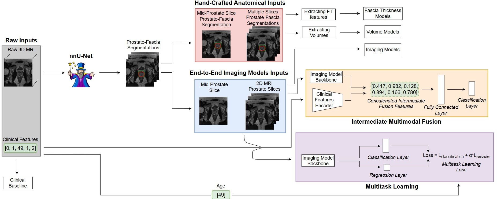

# Evaluating the Predictive Value of Preoperative MRI for Erectile Dysfunction Following Radical Prostatectomy

## Overview

This repository contains the implementation of using preoperative MRI to classify erectile dysfunction (ED). We assess whether preoperative MRI provides predictive value for ED at 12 months post-radical prostatectomy, beyond established clinical predictors. Our pipeline includes the establishment of a clinical baseline, segmentation-based anatomical features, deep learning on MRI slices, and multimodal fusion models. A schematic overview can be found below 



---

## Installation

Clone the repository and create **two Python environments**:

```bash
git clone https://github.com/GideonRouwendaal/Predicting-ED.git
cd Predicting-ED
```

env_nnunet: for running nnUNet to generate segmentations  
env_main: for running all other experiments (clinical, imaging, fusion, XAI)

> **Note:** Use the official [nnUNet installation instructions](https://github.com/MIC-DKFZ/nnUNet) for setting up the `env_nnunet` environment.

---

## Dataset

The dataset used in this study is **private** and collected at the Netherlands Cancer Institute (NKI). It includes:

- `Image.nrrd`: Preoperative MRI scan  
- `Segmentation.seg.nrrd`: Expert-labeled fascia and prostate masks (available for a subset)

These files are first structured using:

```bash
python move_data_nnUNet.py
```

Patients with segmentations are placed in the Train folder; unsegmented patients go in Test to generate automatic segmentations using nnUNet.

To extract single- and multi-slice representations from MRI, run:

```bash
python move_data_nnUNet.py
```

This will generate data for both single-slice and multi-slice models. Resulting directory structure:
```
single_slice_folder/
└── IIEF15_01_12m/
    └── Train/
        ├── ED/
        └── no_ED/

multiple_slices_folder/
└── IIEF15_01_12m/
    └── Train/
        ├── ED/
        └── no_ED/
``` 

---

## Code Structure

| Folder        | Description                                                                           |
|---------------|---------------------------------------------------------------------------------------|
| `nnUNet/`     | Preprocessing and segmentation using nnUNet and generating the different MRI slices   |
| `Clinical/`   | Clinical-only baseline models (e.g., LightGBM, SHAP analysis)                         |
| `FT/`         | Fascia Thickness features: handcrafted anatomical feature modeling                    |
| `Volume/`     | Prostate and fascia volume-based features                                             |
| `MRI/`        | Deep learning on MRI slices (ResNet, ViT, Hybrid-RViT)                                |
| `Multimodal/` | Fusion of clinical and imaging features via intermediate fusion and MTL               |
| `XAI/`        | Explainability: SHAP (clinical/fusion) and attention maps (MRI models)                |
| `Utils/`      | Utility script for the fold generation                                                |

Each folder contains self-contained scripts and models for the corresponding approach.  
All approaches share a common fold structure, which can be generated using:

```bash
python Utils/generate_folds.py
```

--- 

## Usage

Below are the commands to run each experimental block. Make sure to adjust `<path>` and `<model_type>` where applicable.

---

### Clinical Baseline

Each script corresponds to a model (e.g., `RF`, `LightGBM`, `XGBoost`, etc.)

```bash
python Clinical/cv_<Model>.py
```

---

### Fascia Thickness (FT) Approach

1. **Generate features**:
```bash
python FT/generate_dict_<version>.py
```

Where `<version>` is one of:
- `single_slice`
- `multiple_slices`

2. **Run model**:

For single-slice approach
```bash
python FT/radial_approach_cv_single_slice.py
```

For multiple-slices approach  
```bash
python FT/radial_approach_cv_all_slices.py
```
---

### Volume-Based Approach

1. **Generate features**:
```bash
python Volume/generate_dict_volume.py
```

2. **Run model**:
```bash
python Volume/volume_approach_predict.py
```  

### MRI-Based Deep Learning

1. **Start with single-slice model**:

```bash
python MRI/CV_single_slice.py \  
  --model_type <model_type> \  
  --data_path <path_to_Train> \  
  --folds_path <path_to_folds> \  
  --n_outer_folds 5 \  
  --n_inner_folds 3 \  
  --n_epochs 400 \  
  --n_trials 500 \  
  --patience 50 \  
  --pretrained <pretrained\|not_pretrained>
```

2. **Then run the multi-slice variants**: <br>

Mid-prostate slices
```bash
python MRI/train_multiple_2D_1_3.py ...
```  

Base and mid-prostate slices  
```bash
python MRI/train_multiple_2D_2_3.py ...
```  

All prostate slices
```bash
python MRI/train_multiple_2D.py ...
```  


*The single-slice variant (`CV_single_slice.py`) should be run first.*

---

### Multimodal: Intermediate Fusion

```bash
python "Multimodal/Intermediate Fusion/cv_intermediate_fusion.py" \  
  --model_type hybrid_rvit \  
  --data_path <path_to_Train> \  
  --folds_path <path_to_folds> \  
  --n_outer_folds 5 \  
  --n_inner_folds 3 \  
  --n_epochs 400 \  
  --n_trials 500 \  
  --patience 50 \  
  --pretrained pretrained
```

---

### Multimodal: Multitask Learning

```bash
python "Multimodal/Multitask/multi_task_cv.py" \  
  --model_type <model_type> \  
  --data_path <path_to_Train> \  
  --folds_path <path_to_folds> \  
  --n_outer_folds 5 \  
  --n_inner_folds 3 \  
  --n_epochs 400 \  
  --n_trials 500 \  
  --patience 50 \  
  --pretrained <pretrained\|not_pretrained>
```

Applies to:
- `multi_task_cv.py` (single slice)
- `multi_task_multiple_2D_1_3.py` (mid slices)
- `multi_task_multiple_2D_2_3.py` (base + mid slices)
- `multi_task_multiple_2D.py` (all slices)

*Start with the single-slice version before running the others.*

---

### Explainability (XAI)
```bash
python XAI/<file>.py \  
  --model_type hybrid_rvit \  
  --data_path <path_to_Train> \  
  --folds_path <path_to_folds> \  
  --n_outer_folds 5 \  
  --n_inner_folds 3 \  
  --n_epochs 400 \  
  --n_trials 500 \  
  --patience 50 \  
  --pretrained "pretrained"
```
*For XAI, models should already be trained, these scripts process results only and therefore should be run using this command.*

---

## Contact

For questions, suggestions, or collaborations, feel free to reach out:

**Gideon Rouwendaal**  
📧 gideon.rouwendaal@student.uva.nl